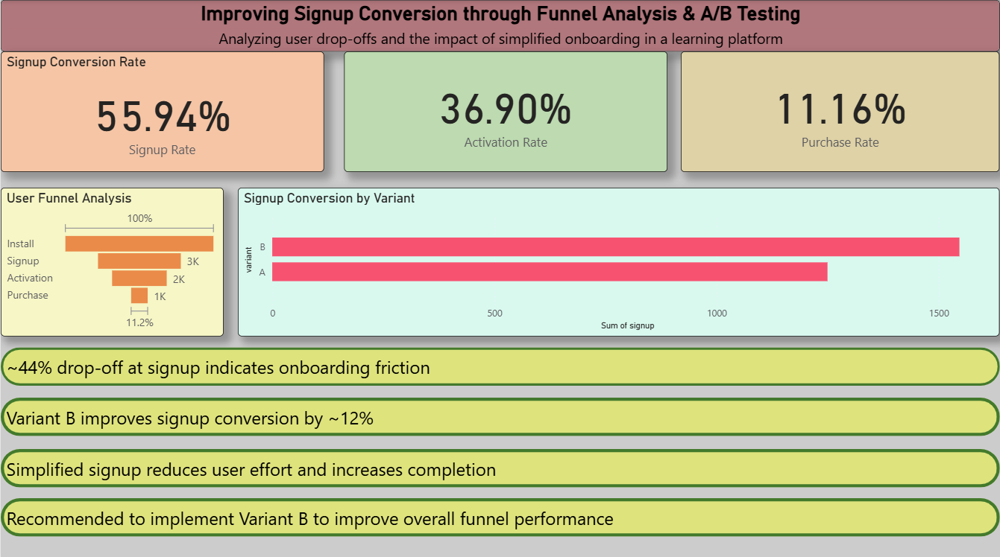

# 📊 Improving Signup Conversion through Funnel Analysis & A/B Testing

## 📌 Project Overview

This project analyzes user behavior in a learning platform to identify conversion bottlenecks and evaluate the impact of a simplified signup process using A/B testing.

The objective is to improve user onboarding and increase overall conversion rates through data-driven decision making.

---

## 🎯 Problem Statement

A significant number of users drop off during the signup process, reducing the number of users who progress through the activation and purchase stages.

**Business Question:**

Can simplifying the signup process improve user conversion rates and overall funnel performance?

---

## 🧠 Project Approach

### 1. Funnel Analysis

Analyzed the user journey across four key stages:

* Install
* Signup
* Activation
* Purchase

Calculated conversion rates and identified major drop-off points within the funnel.

### 2. A/B Testing

Compared two onboarding experiences:

**Variant A**

* Traditional signup form
* Multiple manual input fields

**Variant B**

* Simplified signup flow
* Google one-click login
* Reduced onboarding friction

Performed statistical testing to determine whether the observed improvement was significant.

### 3. Dashboard Development

Built an interactive Power BI dashboard to visualize:

* Funnel performance
* Conversion metrics
* A/B test results
* Business insights and recommendations

---

## 📈 Key Results

| Metric                     | Value  |
| -------------------------- | ------ |
| Total Users                | 5,000  |
| Signup Conversion Rate     | 55.94% |
| Activation Conversion Rate | 36.90% |
| Purchase Conversion Rate   | 11.16% |
| Signup Drop-off            | ~44%   |
| Variant A Signup Rate      | 49.9%  |
| Variant B Signup Rate      | 61.98% |
| Improvement                | ~12%   |

### A/B Test Outcome

* Variant B increased signup conversion from **49.9% to 61.98%**
* Improvement was statistically significant
* P-value: **6.84e-18**

---

## 💡 Business Insights

* Approximately 44% of users drop off during signup, indicating onboarding friction.
* Simplified signup significantly improves user completion rates.
* Variant B outperformed Variant A by approximately 12%.
* Improving the signup stage can positively impact activation and purchase conversions downstream.

---

## ✅ Recommendations

* Implement Variant B as the default onboarding flow.
* Reduce unnecessary form fields during registration.
* Continue monitoring activation and purchase behavior after signup improvements.
* Explore additional experiments to optimize downstream conversion stages.

---

## 🛠️ Tools & Technologies

* Python
* Pandas
* NumPy
* SciPy
* Power BI
* Jupyter Notebook

---

## 📂 Files Included

* `analysis.ipynb` – Funnel analysis and A/B testing
* `user_data.csv` – Project dataset
* `Signup_Conversion_Analysis_AB_Test.pbix` – Power BI dashboard
* `dashboard_screenshot.png` – Dashboard preview

---

## 📊 Dashboard Preview

---

## 🚀 Project Outcome

This project demonstrates how funnel analysis and A/B testing can be used to identify conversion bottlenecks, validate product improvements, and support data-driven business decisions.
